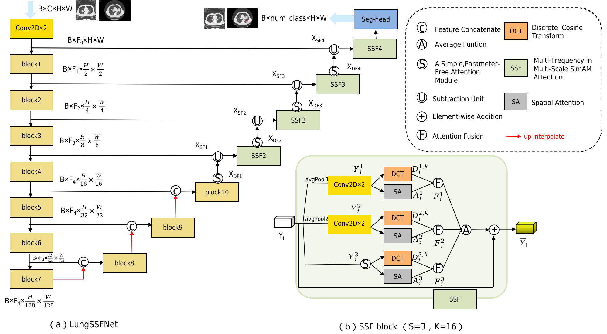
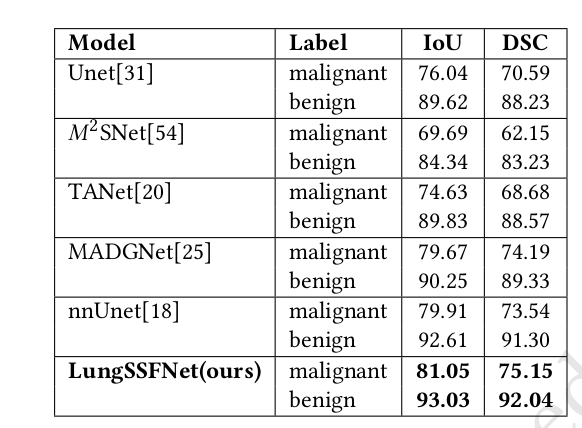
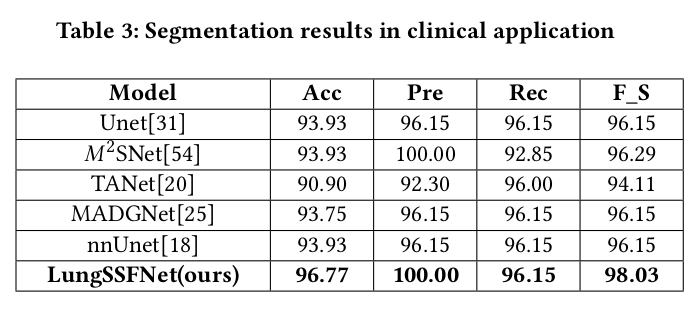

# What is LungSSFNet?

(a) The overall architecture of the proposed LungSSF mainly comprises the "block" and "SSF" module. The "block" is
composed of two CONV2D layers: the first CONV2D layer has a 3x3 kernel with a stride of 1, and the second has a 3x3 kernel
with a stride of 2. (b) First, the "SSF" obtains multi-scale features through pooling with different convolution kernel sizes and
SimAM. These multi-scale features are then represented in the spatial domain (Spatial Attention) and the frequency domain
(Discrete Cosine Transform). Finally, the characterized multi-scale features are aggregated using the Attention Fusion and
Average function.

# Experiment Results
## Segmentation results in model performance

## Segmentation results in clinical application
